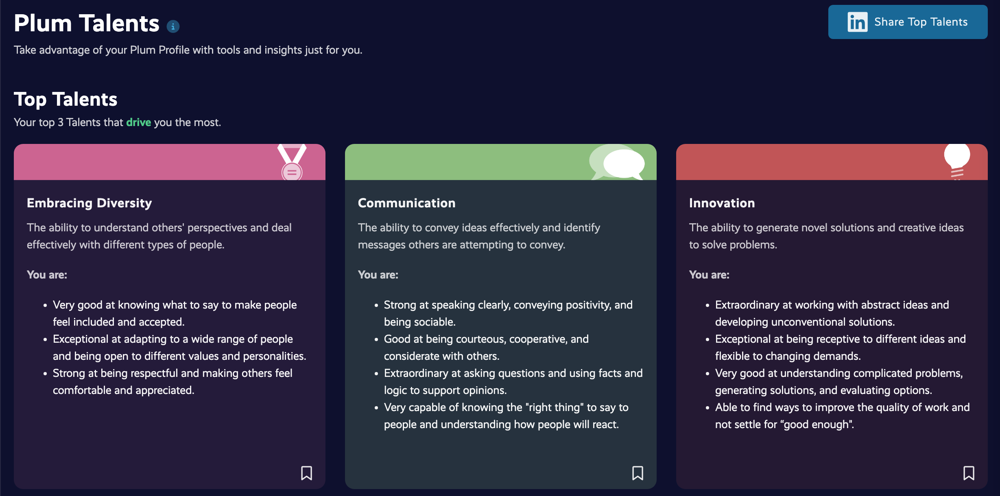
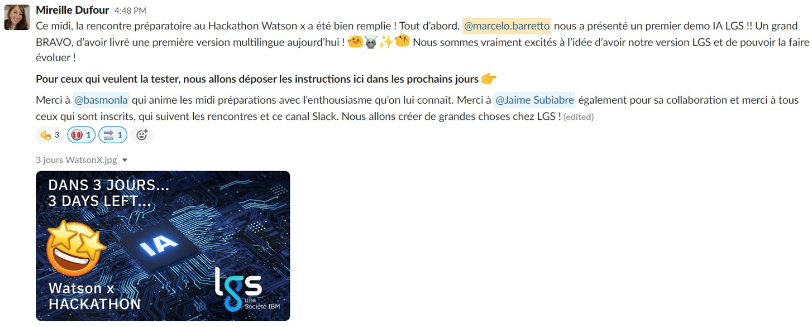
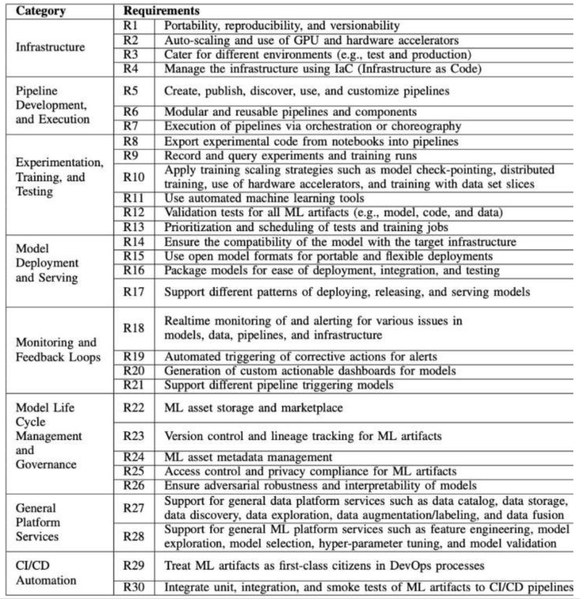
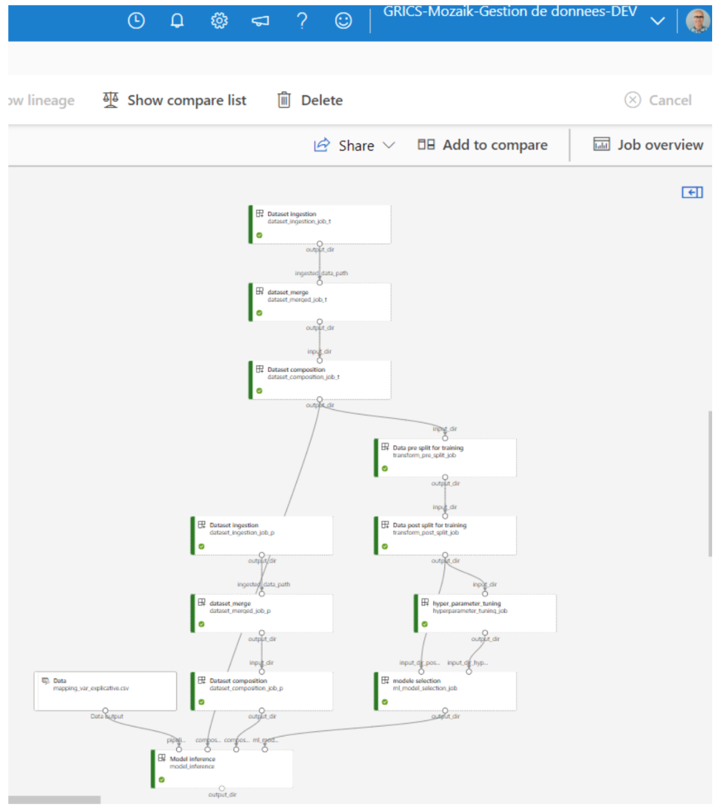
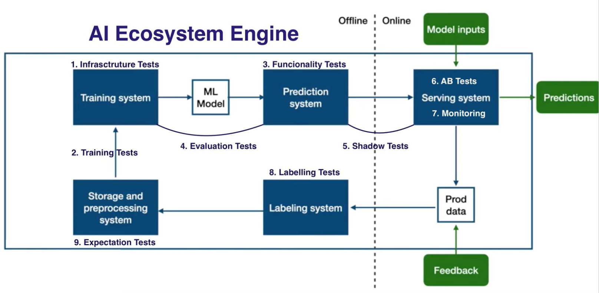
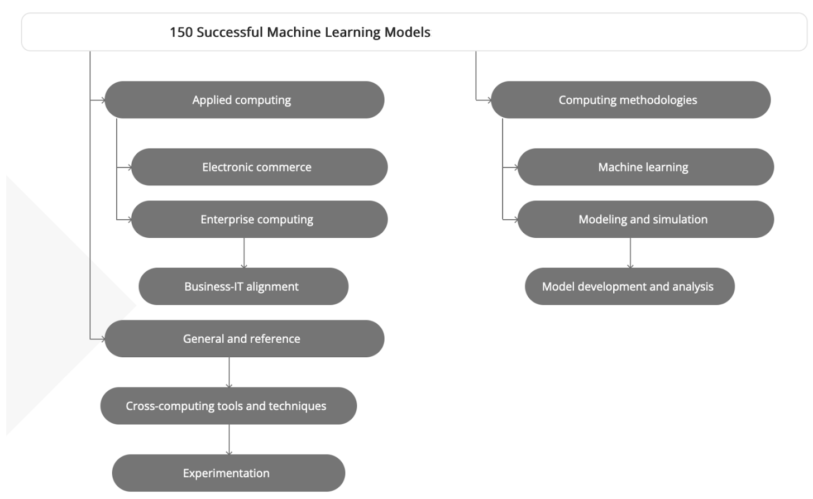
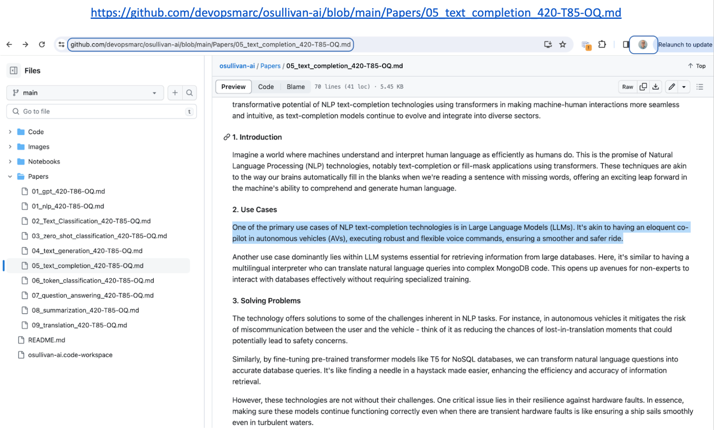

# **Portfolio de Cientista de Dados e IA**  <!-- Largest -->
 
**✨ Marcello Barretto, M.Sc. ✨** - 📧 safe2relay2marc@duck.com  

**🏅 Certificado em agentes de IA complexas 🤖** 

**Github:** https://github.com/devopsmarc/osullivan-ai

**Twitter:** https://twitter.com/xab_marc

Como cientista de dados especializado em arquitetura GenAI de empresas™ e em inteligência artificial, tenho mais de 20 anos de experiência no domínio de tecnologia e evolução da inteligência artificial. Meu portfolio e minha experiência como a cientista de dados e com IA destacam as seguintes competências:

-**1-** Implantação bem-sucedida de modelos de IA desde a concepção até a transição para a pré-produção.

-**2-** Desenvolvimento de modelos de IA generativa e de modelos ML para aplicações futuras.

-**3-** Implantação completa de ecossistemas de IA generativa que sustentam as aplicações futuras.

-**4-** Mais de 10 anos de validação de modelos de aprendizado automático e de IA no Vale do Silício.

-**5-** Projetos de pesquisa e inovações na indústria de Óleo e Gás, Seguros e Serviços financeiros.

-**6-** Excelentes referências profissionais sobre meu trabalho como cientista de dados e em IA.

### -**1-** Implantação bem-sucedida de modelos de IA desde a concepção até a transição para a pré-produção.

### -**2-** Desenvolvimento de modelos de IA generativa e de modelos ML para aplicações futuras.

### -**3-** Implantação completa de ecossistemas de IA generativa que sustentam as aplicações futuras.

### -**4-** Mais de 10 anos de validação de modelos de aprendizado automático e de IA no Vale do Silício.

### -**5-** Projetos de pesquisa e inovações na indústria de Óleo e Gás, Seguros e Serviços financeiros.
https://github.com/devopsmarc/osullivan-ai/blob/main/Papers/05_text_completion_420-T85-OQ.md

### -**6-** Excelentes referências profissionais sobre meu trabalho como cientista de dados e em IA.

**-◊◊◊- Referências Profissionais -◊◊◊-**  

À título de referências, teria prazer em compartilhar as seguintes referências profissionais:

**M. Ray Morel**, Coordenador de recursos humanos, ramorel@osullivan-quebec.qc.ca

**M. Laurent Robitaille-Lainesse**, Consultor de empresas, lrobitaillelainesse@quebecinternational.ca

**M. Pascal Kevin Dubeau**, Diretor de desenvolvimento estratégico, kevin.dubeau@direction.com

**Mme. Sophie Isabelle**, Serviço de desenvolvimento profissional da Universidade Laval, sophie.isabelle.1@ulaval.ca

**Mme. Mélanie Ross**, Responsável pela organização escolar e colocação, melanie.ross@cegeplimoilou.ca

**M. Yoan Cyr**, Consultor de atração de talentos em tecnologia da informação, yoan.cyr@transports.gouv.qc.ca

**Mme. Roxanne Drapeau**, Consultora de atração e dotação, roxanne.drapeau@vrrh.ulaval.ca

**M. Sébastien Tanguy**, Diretor geral, sebastien@lecampquebec.com

**Mme. Pauline Lavoie**, V.P. de desenvolvimento de negócios, pauline@ecosysai.com
