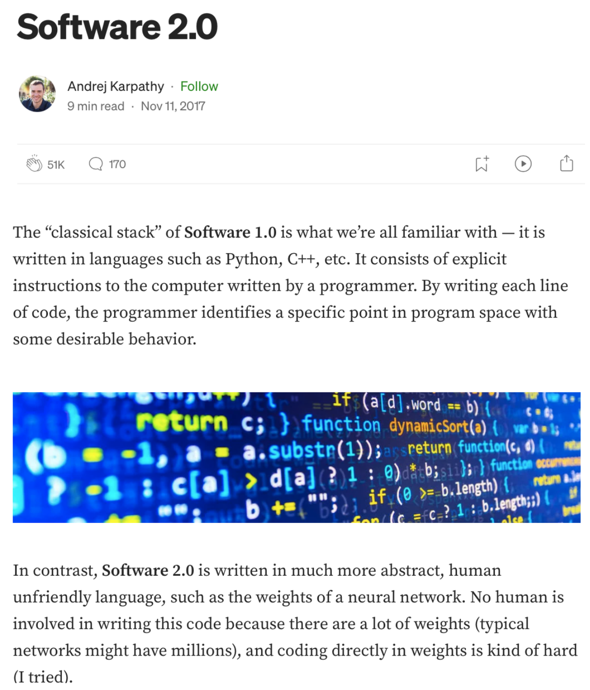

# Why? 
**Within an AI Ecosystem:**

    » Works better, more general, has several computational advantages

## Software 1.0 
- traditional programs with explicit instructions (python / c++ / etc)

## Software 2.0 
- humans specify goals, and algorithm searches for a program that works
- 2.0 programmers work with datasets, which get compiled via optimization

**Implications:**
                
    » look for complicated rule-based software where we can learn the rules instead of programming them

[[6]](https://karpathy.medium.com/software-2-0-a64152b37c35)<small><i> Software 2.0 - Andrej Karpathy Blog</i></small>

