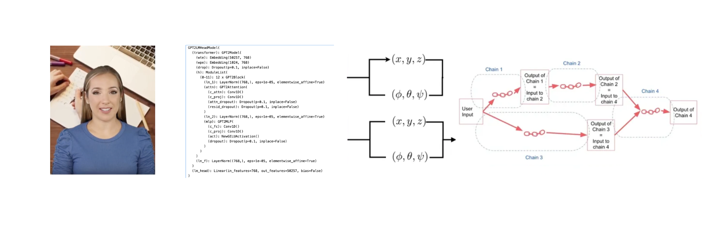
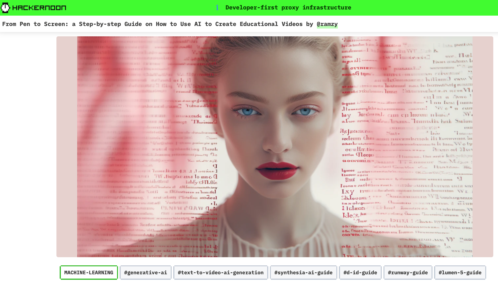

# **Running case study - BIA AI Assistant** 

1. why split into templates?
    - data efficiency 
    - cheaper in terms of labeled data
    - easy to diagnose issue
    - auditability - not just regressing prompt to AI Assitant

2. why not end-to-end?
   - state and control

[[x]](https://hackernoon.com/from-pen-to-screen-a-step-by-step-guide-on-how-to-use-ai-to-create-educational-videos)<small><i> Hackernoon</i></small>
   
