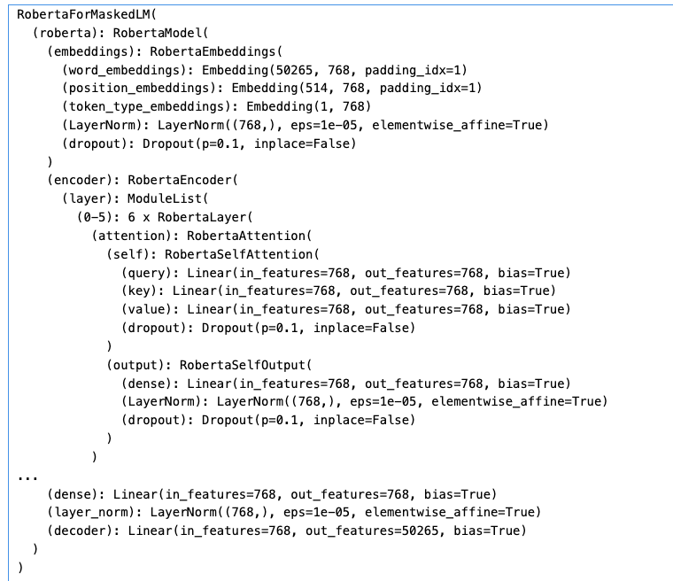

<h2 style="text-align:center;">NLP Text Completion model: { distilroberta-base }</h2>

<strong>M.Sc Marcello Barretto</strong>

Collège O'Sullivan de Québec

{mabarretto}@osullivan-quebec.qc.ca

<h4 style="text-align:center; font-weight:bold;font-style:italic;">Abstract</h4>

This paper delves into the burgeoning field of Natural Language Processing (NLP) and its application in text-completion tasks using transformer models, highlighting their impact and potential across various domains. NLP technologies, particularly through text-completion or fill-mask applications, have started bridging the gap between human-like language understanding and machine execution. The paper discusses key use cases such as Large Language Models (LLMs) in autonomous vehicles, providing an enhanced and safer user experience, and models that facilitate effective interaction with complex databases for non-experts. The conclusion underscores the transformative potential of NLP text-completion technologies using transformers in making machine-human interactions more seamless and intuitive, as text-completion models continue to evolve and integrate into diverse sectors.

#### 1. Introduction

Imagine a world where machines understand and interpret human language as efficiently as humans do. This is the promise of Natural Language Processing (NLP) technologies, notably text-completion or fill-mask applications using transformers. These techniques are akin to the way our brains automatically fill in the blanks when we're reading a sentence with missing words, offering an exciting leap forward in the machine's ability to comprehend and generate human language.

#### 2. Use Cases

 One of the primary use cases of NLP text-completion technologies is in Large Language Models (LLMs). It's akin to having an eloquent co-pilot in autonomous vehicles (AVs), executing robust and flexible voice commands, ensuring a smoother and safer ride.

Another use case dominantly lies within LLM systems essential for retrieving information from large databases. Here, it's similar to having a multilingual interpreter who can translate natural language queries into complex MongoDB code. This opens up avenues for non-experts to interact with databases effectively without requiring specialized training.

#### 3. Solving Problems

The technology offers solutions to some of the challenges inherent in NLP tasks. For instance, in autonomous vehicles it mitigates the risk of miscommunication between the user and the vehicle - think of it as reducing the chances of lost-in-translation moments that could potentially lead to safety concerns.

Similarly, by fine-tuning pre-trained transformer models like T5 for NoSQL databases, we can transform natural language questions into accurate database queries. It's like finding a needle in a haystack made easier, enhancing the efficiency and accuracy of information retrieval.

However, these technologies are not without their challenges. One critical issue lies in their resilience against hardware faults. In essence, making sure these models continue functioning correctly even when there are transient hardware faults is like ensuring a ship sails smoothly even in turbulent waters.

#### 4. Conclusion

In conclusion, NLP text-completion or fill-mask using transformers presents tremendous potential in various domains, from autonomous vehicles to question-answering systems. However, just like any other voyage into uncharted territory, there are obstacles that need addressing - most notably ensuring their resilience against hardware faults. As we continue to refine these technologies, we stand on the cusp of a world where machine-human interaction becomes more seamless and intuitive than ever before. [^1^] [^2^] [^3^] [^4^] [^5^].

#### 5. BibTeX

- - - 

@misc{Collège O'Sullivan de Québec,

  author = {Marcello Barretto},

  title = {NLP, 2024},

  howpublished = "Collège O'Sullivan - e.Campus",

  year = {2024},

  note = "[GitHub Online; 420-T85-OQ]"}

- - - 

#### 6. References

[^1^]: [Towards Concept-Aware Large Language Models](https://arxiv.org/abs/2311.01866)
[^2^]: [Crass: A novel data set and benchmark to test counterfactual reasoning of large language models](https://arxiv.org/abs/2112.11941)
[^3^]: [Resilience assessment of machine learning applications under hardware faults](https://open.library.ubc.ca/soa/cIRcle/collections/ubctheses/24/items/1.0435699)
[^4^]: [Resilience Assessment of Large Language Models under Transient Hardware Faults](https://ieeexplore.ieee.org/abstract/document/10301253/)
[^5^]: [Dynamic QA System for NoSQL Databases](https://dspace.univ-guelma.dz/xmlui/handle/123456789/15019)

