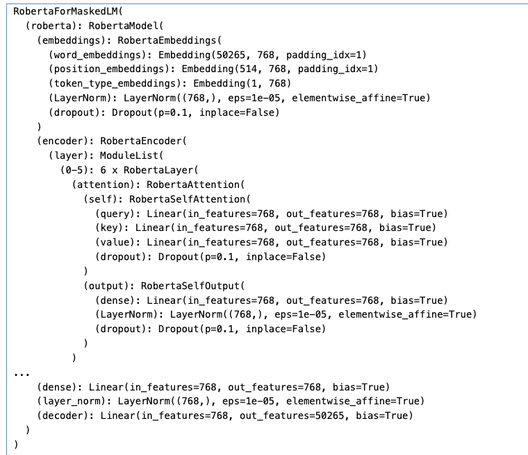

<h2 style="text-align:center;">NLP Token Classification (NER) model: { dbmdz/bert-large-cased-finetuned-conll03-english }</h2>

<strong>M.Sc Marcello Barretto</strong>

Collège O'Sullivan de Québec

{mabarretto}@osullivan-quebec.qc.ca

<h4 style="text-align:center; font-weight:bold;font-style:italic;">Abstract</h4>

This paper explores the integration and effectiveness of transformer models in Token Classification (NER), an important aspect of NLP. Token classification involves classifying entities within text into distinct categories like names, organizations, or locations. The paper presents use cases in diverse fields: social media analysis, where the unique linguistic styles on platforms like Twitter demand advanced models; cyber threat intelligence, which requires adaptability to new terminologies; and pharmaceutical research, where accurate identification of chemical and protein entities is crucial. Despite their successes, transformer models face challenges, particularly in managing domain specificity, indicating a need for optimization across various domains. The conclusion underscores the transformative impact of these models in token classification, demonstrating their versatility and potential across a wide range of applications.

#### 1. Introduction

Token Classification or its more poplular expression Named Entity Recognition (NER) stands as a crucial component in the field of NLP. The purpose of token classification is to identify and classify named entities in text into predefined categories such as names of people, organizations, locations, expressions of times, quantities, percentages, etc. In recent years, transformer models have been extensively employed to tackle NLP tasks including token classification.

#### 2. Use Cases

Social Media Analysis: An example of a practical application of transformer models in token classification can be found in the analysis of social media content [^2^]. The unique language styles found on platforms like Twitter pose a challenge for traditional NLP tools and thus make a case for the use of advanced transformer models.

Cyber Threat Intelligence: Transformer models have also proven to be useful in recognizing named entities within cyber threat intelligence data [^3^]. Given the dynamic nature of cyber threats, there is a constant need for efficient and effective models that can quickly adapt to new terminologies and patterns.

Pharmaceutical Research: Token classification recognition becomes particularly critical within pharmaceutical research where identifying chemical and protein entities accurately could have significant impacts [^4^]. For instance, researchers used BERT model to recognize chemical and protein entities from Spanish Clinical Case Corpus (SPACCC), which is a part of the PharmaCoNER corpus4.

#### 3. Challenges

One key challenge in token classification involves managing domain specificity. It was observed that the choice of domain significantly influenced performance regardless of data size or model chosen [^1^]. This reveals an area where transformer models could potentially be optimized for better performance across diverse domains.

#### 4. Conclusion

In conclusion, transformer-based models have shown great promise in improving outcomes for tasks such as token classification. Despite some challenges, their use across various fields from social media content analysis to pharmaceutical research validates their potential and versatility [^1^] [^2^] [^3^] [^4^].

#### 5. BibTeX

- - - 

@misc{Collège O'Sullivan de Québec,

  author = {Marcello Barretto},

  title = {NLP, 2024},

  howpublished = "Collège O'Sullivan - e.Campus",

  year = {2024},

  note = "[GitHub Online; 420-T85-OQ]"}

- - - 

#### 6. References

[^1^]: [Evaluating pretrained transformer-based models on the task of fine-grained named entity recognition](https://orbilu.uni.lu/handle/10993/45217)
[^2^]: [Annotating the Tweebank corpus on named entity recognition and building NLP models for social media analysis](https://arxiv.org/abs/2201.07281)
[^3^]: [Named entity recognition in cyber threat intelligence using transformer-based models](https://ieeexplore.ieee.org/abstract/document/9527981/)
[^4^]: [Deep learning with language models improves named entity recognition for PharmaCoNER](https://bmcbioinformatics.biomedcentral.com/articles/10.1186/s12859-021-04260-y)

