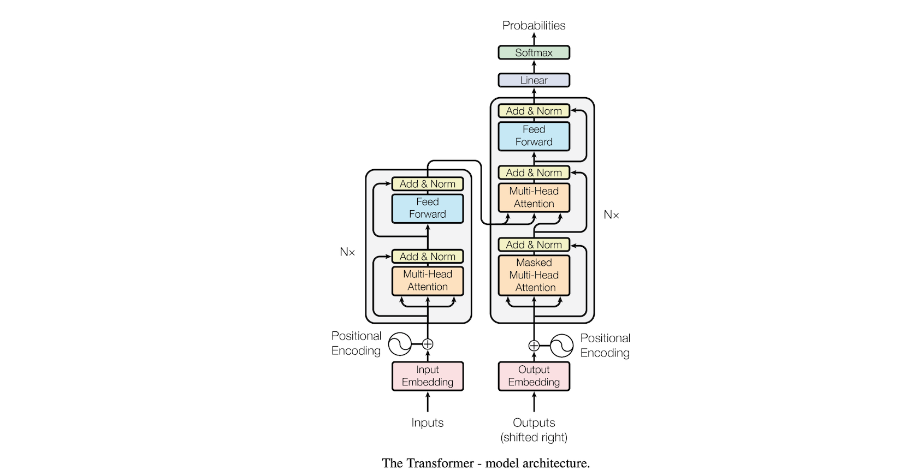

## **Devenez un(e) Expert(e) en Intelligence Artificielle**

L'intelligence artificielle, une technologie révolutionnaire, imite l'intelligence humaine dans des machines programmées pour réfléchir et agir à l'instar des êtres humains. Ce domaine novateur ouvre la porte à une efficacité accrue dans le monde des affaires et facilite de nombreux aspects de notre vie de tous les jours.

En rejoignant le programme d'Intelligence Artificielle du Collège O'Sullivan de Québec, vous plongerez au cœur d'un secteur en constante évolution. Vous découvrirez les vastes possibilités qu'offre l'IA tout en acquérant des compétences fondamentales, indispensables pour propulser votre carrière dans ce domaine passionnant.

Au-delà des bases théoriques, ce programme vous offre une expérience pratique inestimable. Vous travaillerez sur des projets concrets, vous familiarisant ainsi avec les dernières innovations et applications de l'IA. Que ce soit dans le traitement automatique du langage naturel, l'apprentissage automatique ou les modèles de l'IA, vous serez à la pointe de la technologie et prêt à relever les défis de demain.
